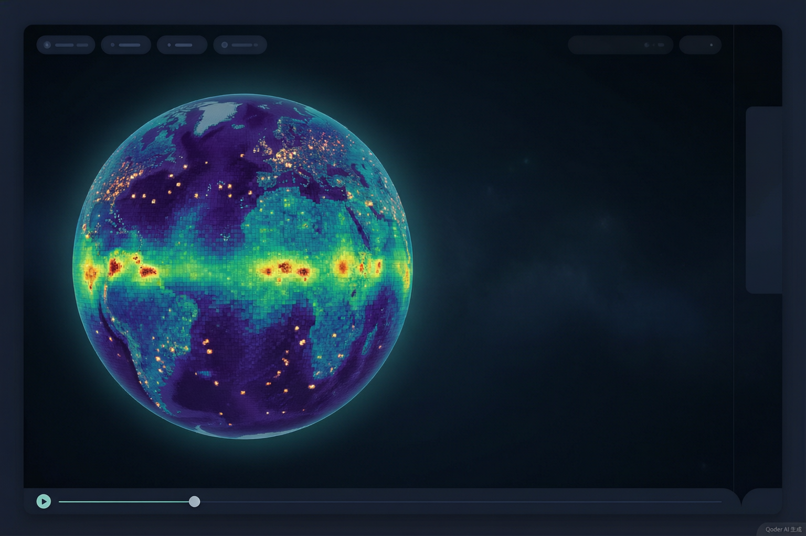

# 设计-可视化 v1：三维球体（three.js 地球仪）

> 2026-10-11｜轻舟 `[本地开发·可视化线]`｜状态：**设计稿·待 owner 拍板**（拍板前零代码改动）
> 上游：owner 直令（"我们不是球形世界吗，怎么是这样的，还是用 three.js 吧，先出文档"）
> 本文 = 做成什么样 + 技术方案 + 里程碑 + 我的建议 + 待拍板项；拍板后开工。

## 〇、一句话

世界从"**平铺地图**"升级为"**三维地球仪**"：新增 three.js 球体渲染视图，同一份数据包两端通吃；
**导出器、数据契约（`viz/CONTRACT.md`）、仪表盘零改动**——只动 `viz/web` 渲染层。

## 一、为什么现在看起来是平的（先回答"怎么是这样的"）

不是 bug，是 v0 的"刻意直读"口径：

1. **世界确实是球形的**——网格是等距圆柱投影（纬度行 × 经度列），等价于"一张摊平的世界地图"：
   经度两端首尾相接（球面上无缝），行 0 = 北极、末行 = 南极。
2. **v0 把这张"地图"直接画成了位图**：`WorldCanvas` 把每格 `uint8` 当像素直接上色（Canvas2D + ImageData）。
   等距圆柱数据摆成矩形 = 平面地图视角——数据没错，只是读法是"摊开看"。
3. 这是 v0 明说的非目标：v0 设计稿 §二"**v0 不上 WebGL**"——先保"看得到、可复查（数值级）"，
   3D 视角当时列为后续。

> 一句话：**数据一直是球形时空，只是 v0 选择了"地图"读法；v1 加"地球仪"读法。**

两种读法各有强项，建议**并存**：

| 读法 | 强项 |
|---|---|
| 平面地图（现有） | 读数对形：查具体格值、极区邻接、精确对照实验记录 |
| 三维地球仪（v1） | 读整体对形：球面连续性、极区几何、实体空间分布直觉 |

## 二、做成什么样（意向图）



（意向图 = AI 生成氛围图，非程序截图；实际观感以 M1 在 dev server 里的效果为准）

- **深色太空底**：四周留黑、球体带一圈柔和光晕；
- **数据即球面纹理**：当前图层帧（uint8 经 viridis 上色）贴在球面；放大可见**格块感**
  （NearestFilter，保留"格子世界"的粗粝感，不做平滑插值）；
- **实体发光点**：存活实体按行列 → 经纬度定位、微微浮出球面，能量越高越亮（沿用现有暖色带）；
- **底线不变**：底部控制条（播放/暂停、进度、倍速、图层）与右侧仪表盘**原样复用**，
  播放/拖动进度时球面同步逐帧刷新；
- **鼠标**：拖动旋转、滚轮缩放（OrbitControls 手感）；空闲自动缓转默认关（拍板项）。

## 三、技术方案

### 3.1 唯一新增依赖：three.js

`three`（OrbitControls 在 three 包内，无其他新依赖）。npm 安装，锁进 `package.json`。
**不引入 react-three-fiber**（理由见 §五·4）。

### 3.2 渲染管线（数据流不变）

```
已加载帧 → uint8 栅格(rows×cols)
   ├─（现有）WorldCanvas：ImageData → 平面位图
   └─（新增）WorldGlobe ：viridis LUT 上色 → THREE.DataTexture → SphereGeometry 球面
entities 缓冲(7列) → 行列/亚格 → 经纬度 → 球面坐标 → THREE.Points（能量分色）
```

- **贴图**：每帧把 `grid` 经 `palette.ts` 的 `viridisLut()` 转 RGBA（**复用现有纯函数**，不新增调色逻辑）
  → `DataTexture`（`NearestFilter`、关 mipmap）。
- **球面**：`SphereGeometry` 的 UV 天然对齐等距圆柱布局（经度→u、纬度→v）；
  仅需处理一处 **v 轴行序翻转**（数据行 0 = 北极端在顶；three.js 贴图 UV 原点在左下）——
  在贴图/UV 一侧翻转一次，不做二次换算。
- **纹理复用**：固定一张 `DataTexture`，逐帧只更新像素缓冲 + `needsUpdate = true`，
  不逐帧重建对象（460,800 格 = 960×480 纹理，GPU 级别的小图，60fps 无压力）。
- **实体层**：`THREE.Points` + 顶点色（`energyColorCss` 同款暖色带）；
  点位半径 = R×(1+ε) 微微浮起避免深度冲突；亚格坐标沿用 WorldCanvas 同款
  "帧级一致性校验 → 不过则回退格中心"逻辑（契约 v0 修订1 §4），行为与平面视图一致。
- **极区**：球面自然收敛——平面图上极区的横向拉伸失真在球体上消失。

### 3.3 改动面（尽量小）

| 文件 | 动作 |
|---|---|
| `render/WorldGlobe.tsx` | **新增**（three.js 球体组件，props 与 WorldCanvas 同构：meta/grid/entities 进，画面出） |
| `App.tsx` | 小改：世界区加"平面 / 球体"视图切换按钮（默认球体，拍板项） |
| `package.json` | + `three`（+ `@types/three` dev） |
| store / loader / palette / ControlsBar / SeriesChart / CONTRACT.md / exporter | **不动** |

开发位置：工作树 `.worktrees/VIZ`，新分支 `feat/viz-v1-globe`（自当前 feat/viz-v0 顶端分出），完工并 main。

## 四、里程碑（每步 dev server 里直接可看）

- **V1-M1 球体骨架**：深底 + SphereGeometry + 当前帧贴图 + OrbitControls（拖转/缩放）。
  先看"球立不立得起来、手感对不对"。
- **V1-M2 回放接线**：逐帧换纹理接进现有播放器（播放/拖动进度/切图层自动生效）；
  确认长时间播放无内存增长。
- **V1-M3 实体层**：Points 实体点上线（能量分色）+ 平面/球体切换按钮。
- **V1-M4 打磨**：光晕/接缝检查/缩放自适应/空闲缓转（若拍板开）+ 与平面视图同帧对照。

每步产出停下来给你看，确认后再进下一步（沿用节点停你审的规矩）。

## 五、我的建议

1. **贴图方案而非逐格三维块**：460k 格逐格建模（instanced mesh）是 460k 个实例，重且失焦；
   纹理贴球是 GPU 本行，还保住了"数据格块感"，极区也自然收拢。
2. **保留平面视图**（建议默认球体、可一键切回）：查数用平面、看全局用球体；
   两条渲染路径独立、数据与播放器共享，并存成本近零。
3. **先 M1 看手感再往下**：球体的"味道"（大小、明暗、光晕、转速）在图上看不准，M1 很短就能见到真的。
4. **只加 three 一个依赖，不上 react-three-fiber**：R3F 多一层抽象 + 一批依赖；
   本项目渲染逻辑简单（一张纹理 + 一组点 + 相机控制），裸 three 更好控、更好调试、更能"看穿"。
5. v2+ 候选（先不馋）：资源场当高度图（起伏地形）、信号场可视化、昼夜光照、多 run 对照、LOD。

## 六、待拍板（拍板即开工）

1. **平面视图**：保留作切换（推荐）还是直接替换？
2. **实体点**：球体上默认开（推荐）还是默认合？
3. **视觉基调**：沿用现有深色底 + viridis + 暖色实体（推荐）还是换基调？
4. （可选）**空闲自动缓转**：默认关（推荐）还是开？

## 更新记录

- 2026-10-11 初稿（轻舟）：平面→球体动因、意向图、技术方案、四里程碑、建议、待拍板 4 项。
